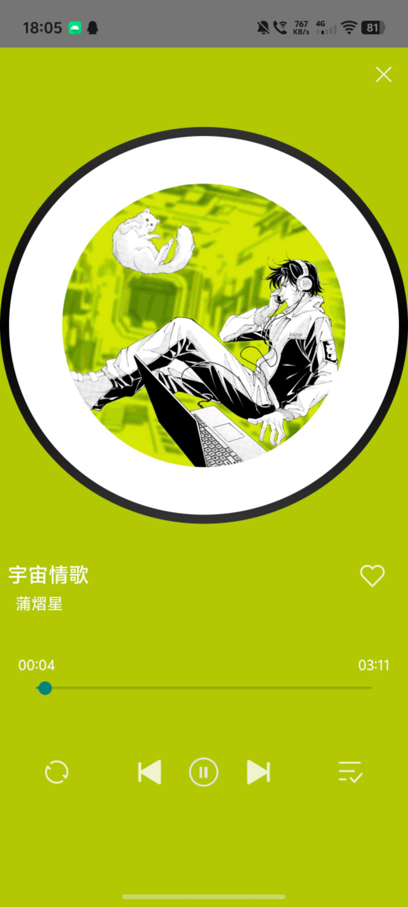

# Music App

一个基于 **Android Studio** 开发的音乐播放器应用，实现了歌曲展示、推荐页面、播放控制与播放详情页等核心功能，具备较完整的音乐播放 App 原型。

## 项目简介

本项目是一个移动端音乐播放器应用，主要用于练习 Android 应用开发流程与界面交互实现。  
应用包含首页推荐、歌曲分类展示、播放详情页和底部播放器控制栏等模块，支持基本的音乐播放操作与页面跳转。

## 功能特性

- 首页歌曲推荐展示
- 专属好歌 / 每日推荐 / 热门金曲等模块展示
- 歌曲播放详情页
- 播放 / 暂停 / 上一首 / 下一首
- 播放进度条展示
- 底部迷你播放器控制栏
- 本地数据展示与界面交互
- 支持基础页面跳转与模块切换

## 项目截图

### 首页


### 播放详情页



## 技术栈

- **开发工具**：Android Studio
- **开发语言**：Java
- **界面实现**：XML
- **核心组件**：
  - Activity / Fragment
  - RecyclerView
  - MediaPlayer
  - SQLite / Room（如果你项目里用了可以保留）
- **其他**：
  - 页面跳转与交互逻辑实现
  - 本地资源管理
  - 基础数据存储

## 项目结构

```text
app/
├── src/
│   ├── main/
│   │   ├── java/        # Java 源代码
│   │   ├── res/         # 布局、图片、字符串等资源文件
│   │   └── AndroidManifest.xml
├── build.gradle
